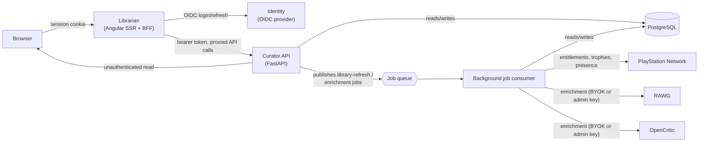
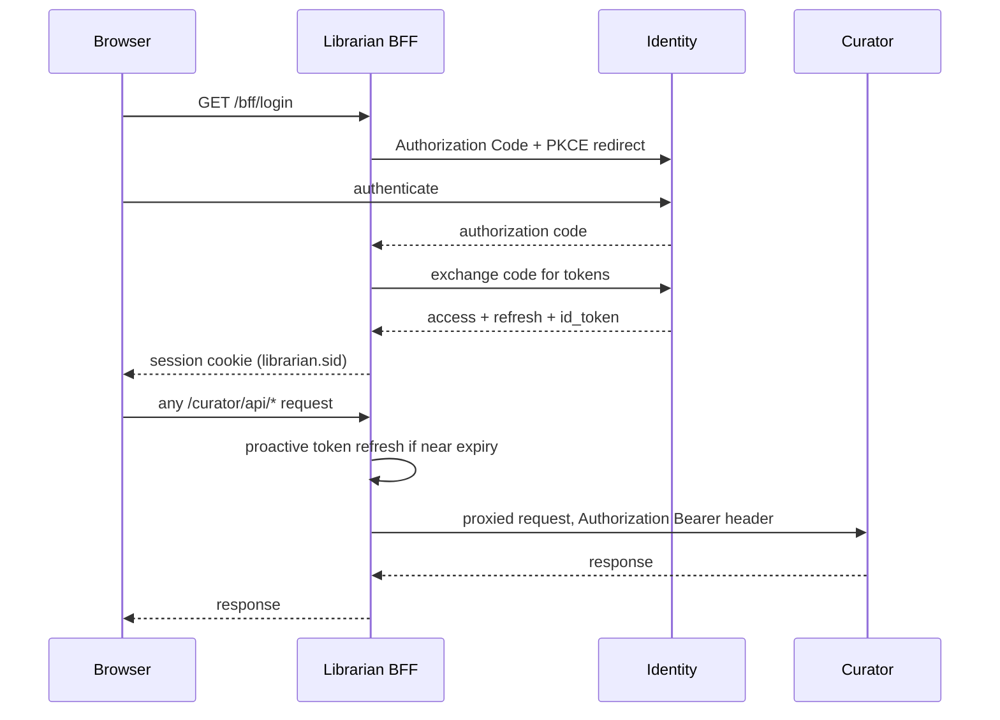
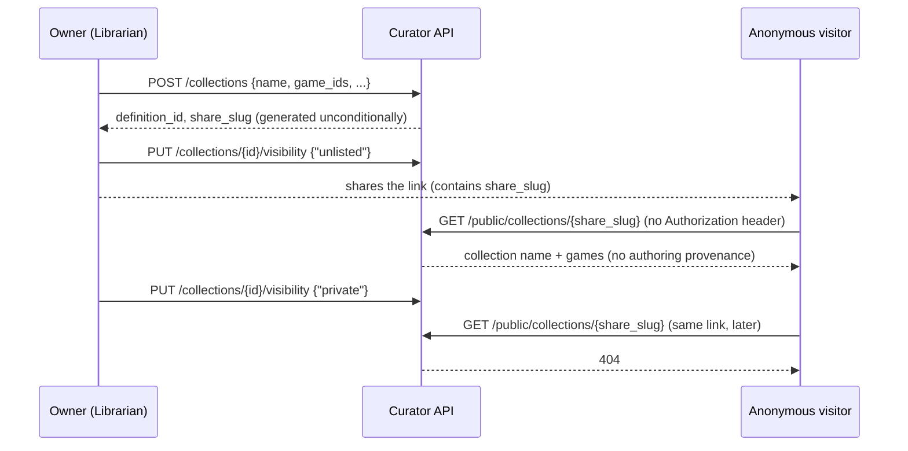
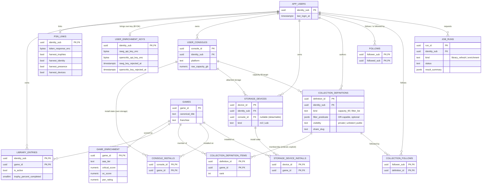
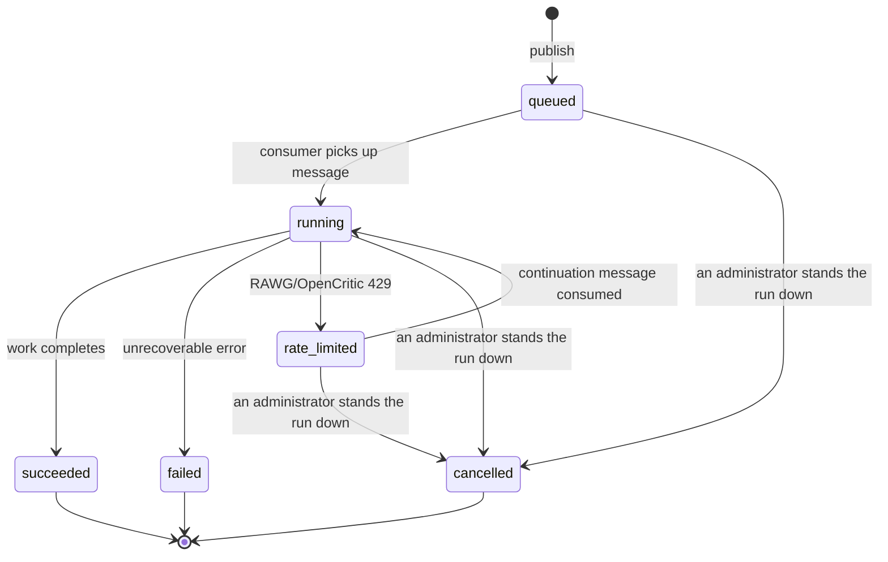

# Architecture

Curator is a PlayStation game-curation API. A user links their PlayStation Network (PSN) account, imports
their entitlements (owned games), and builds named **collections** from them — explicit, ordered lists a
user curates and can optionally share via a public link. [Librarian](https://github.com/crgolden/Librarian)
is the web frontend; it never calls PSN, RAWG, or OpenCritic itself. Those calls come from two places only:
this API, for anything a user is waiting on, and the background job consumer, for the long-running imports
and enrichment passes it picks up off the job queue.

## System overview



The last edge covers the three routes that take no `Authorization` header at all:
`GET /public/collections/{share_slug}`, serving a collection's public share link to anyone with the link,
and `GET /catalog/games` / `GET /catalog/games/{gameId}`, the shared game catalog. The catalog is public
content with no per-user data in it, and Librarian publishes a `/sitemap.xml` covering every game's detail
page — so those two routes have to answer without a session for the pages to be indexable at all.

## Sign-in

Librarian's BFF (Backend-for-Frontend) holds the OIDC session; the browser never sees a token.



A 401 from Curator triggers exactly one silent token refresh and retry before the BFF gives up and sends
the browser back through login.

## Library refresh, with rate-limit continuation

`POST /library/refresh` returns immediately with a `run_id`; the actual work happens off the request path
so a large library (PSN allows no batch entitlement endpoint) never ties up an HTTP connection.

```mermaid
sequenceDiagram
    participant Librarian
    participant Curator as Curator API
    participant Queue as Job queue
    participant Worker as Job consumer
    participant DB as PostgreSQL
    participant PSN
    participant RAWG as RAWG / OpenCritic

    Librarian->>Curator: POST /library/refresh
    Curator->>DB: INSERT job_runs (status=queued)
    Curator->>Queue: publish library-refresh message
    Curator-->>Librarian: 202 {run_id}

    Queue->>Worker: deliver message
    Worker->>DB: claim the run -- compare-and-swap on (run_id, seq), skipping stale redeliveries
    Worker->>PSN: fetch entitlements
    Worker->>DB: canonicalize + upsert library_entries/games (commits before enrichment)
    loop each game
        Worker->>RAWG: enrich, using this user's own key
        alt key rejected (401/403)
            Worker->>Worker: disable that provider for the rest of this run, retry the same game
            Worker->>DB: record the rejected key + an audit log entry
        else rate limited (429)
            Worker->>DB: job_runs -> rate_limited, seq bumped, result_summary so far
            Worker->>Queue: schedule continuation message (backoff)
            Note over Worker,Queue: run pauses here; resumes from the same point later
        end
    end
    Worker->>PSN: match + fetch trophy completion
    Worker->>DB: job_runs -> succeeded, with the merged result_summary

    Librarian->>Curator: GET /library/refresh/{run_id} (polled)
    Curator-->>Librarian: status + result_summary
```

Entitlement ingestion commits before enrichment runs, so a rejected key, a rate limit, or a transient
network error during enrichment costs a user enrichment signal and trophy-match data for that pass — never
the underlying library import itself.

`job_runs.seq` is a checkpoint counter, bumped every time a pause is recorded and stamped into that pause's
continuation message. The worker claims a message with a compare-and-swap on `(run_id, seq)`: a message
redelivered after its own settlement failed (e.g. a Service Bus lock lapsing mid-run) carries a `seq` that a
later checkpoint has already superseded, so the guard settles it without reprocessing instead of restarting
the whole batch. The consumer also holds a lease on the row and renews it while it works, so a run that has
stopped being renewed is distinguishable from one still in flight.

## Collection sharing



An unknown `share_slug` and a `"private"` collection's `share_slug` are deliberately indistinguishable —
both 404. A collection that was shared and later made private stops working exactly like one that never
existed; there is no separate "revoked" state to fall out of sync with `visibility`.

## Data model

Scoped to the entities a user or a collaborating repo actually interacts with. Not shown: pure lookup and
provider/contributor-cache tables (`genres`, `publisher_tiers`, `franchise_rules`, `edition_ranks`,
`size_estimates`, `rawg_cache`, `opencritic_cache`, `psn_catalog_cache`,
`exclusion_rules`, `global_exclusions`, `data_quality_flags`,
`game_name_overrides`, `curation_rule_pass_state`, `game_measured_sizes` — WP13's global, upserted,
any-authenticated-user-may-contribute install-size cache, `game_enrichment`'s own shape rather than the
per-user history table it replaced) and audit/history tables (`account_action_log`, `entitlement_pulls`,
`entitlement_snapshots`, `collection_runs`, `collection_items`).



A collection's membership (`collection_definition_items`) is explicit and stored — never a live query. Two
tables carry `genre_filter`/`min_score`/`aaa_tier_filter`/`filter_predicate` as **provenance only**: they
record how a collection was first assembled (and let its owner ask for a fresh proposal), but nothing ever
re-evaluates them to decide what's actually in the collection.

## PlayStation platforms

`platforms` is the reference table and the vocabulary: PS5, PS4, PS3, PSVITA, PSP, PS2, PS1, ordered
newest-first by `sort_order`. `user_consoles`, `game_measured_sizes`, `size_estimates` and
`library_entry_platforms` all point at it by foreign key. `curator.psn.title_platform.CONSOLE_PLATFORM_IDS`
is the Python mirror, held to the table by a test in `tests/test_schema.py` rather than by convention —
a `Literal` cannot be built at runtime, so the alternative is a route that rejects a platform the schema
accepts, with nothing going red.

**Ownership is a set, not a scalar, and `library_entry_platforms` is where it lives.** `library_entries`
still carries a `native_ps5`/`ps4_eligible` boolean pair, written by the worker's canonicalization pass and
kept for it, but two booleans cannot express seven platforms and a third of one measured library is owned
on both PS4 and PS5. Nothing in this repo decides platform membership from that pair any more: the
candidate query for a collection, the platform list on `GET /library`, and the manual-add write path all
read or write `library_entry_platforms`.

**A legacy entitlement's platform comes from its title-id prefix.** PSN returns `entitlementAttributes[]`
— and therefore a `platformId` — only for PS4 and PS5 titles. On a 3,045-entitlement library, 900 rows
carry none at all, going back to 2009, and their only per-platform signal is the title id: `BLUS`/`BCUS`
and friends are PS3, `PCSA`–`PCSH` are Vita, `UCUS`/`ULUS` are PSP. `title_platform` also classifies the
prefixes that are not titles at all — `SUBC`, `SCEA` and `NPIA` are PS Plus SKUs and their reward children
("100% Discount Off"), `NPUP`/`NPUK` are Amazon Instant Video, CBS News and PlayStation Home themes.
`NPIA` reads like a PS3 prefix and is not one. The same map, and it must stay the same map, lives in the
worker as `Functions/Curator/Psn/TitlePlatform.cs`, which is what ingestion actually calls.

## Three PlayStation identifiers, and which of them join

PSN issues three different ids for what a person would call one game, and the catalog keys on a different
one in each table. Confusing them is the single most expensive mistake in this codebase's history —
migration `0023` exists because catalog enrichment was called with a product id where an npTitleId was
required, and PSN answered `200` with an empty match rather than an error, so every enriched row came back
blank for months.

| Identifier | Shape | Where the catalog holds it |
|---|---|---|
| Concept id | `201930`, `10003543` — bare digits | `game_concepts.concept_id` (primary key) |
| Product id | `UP1004-PPSA03420_00-GTAOSTANDALONE01` — three dash-separated segments | `game_concepts.product_id`, `psn_catalog_cache.store_product_id`, `entitlement_snapshots.product_id` |
| npTitleId | `PPSA03420_00`, `CUSA13505_00` | `psn_catalog_cache.title_id` (primary key), `library_entries.title_id` |

A **concept** is the game; a **product** is one purchasable edition of it; an **npTitleId** is one
installable title. One concept has many products and many title ids.

**The middle segment of a product id is not a reliable npTitleId, and must never be used as one.** It
looks like one, and for a storefront product node it is one — the node's own `id` and `npTitleId` agree on
all 199 rows a category walk has populated. But a product routinely covers a *different* title from the
one an entitlement grants: on a 3,045-row `entitlement_snapshots` sample, 824 rows have a product id whose
middle segment differs from the stored title id, 513 of them a PS5 (`PPSA`) product against a PS4 (`CUSA`)
title, plus PS Plus subscription SKUs (`IP9101-PPSA06916_00-PLUS2T12M0000000` granting `NPIA90007_01`).
Splitting the string recreates `0023`'s bug with a plausible-looking value instead of an obviously wrong
one.

**PSN's universal search returns the first two ids and never the third.** A `MobileGames` hit is a
`Concept` whose `result.id` is the concept id; its `defaultProduct.id` is a product id. So a search hit
joins to `game_concepts` and cannot be written into `psn_catalog_cache` at all — which is why
`POST /library/manual`'s store-hit branch creates `games`, `game_concepts` and `game_enrichment` rows and
stops there. Recovering the npTitleId would need a concept-to-titles lookup; the only catalog endpoint
either PSN client library exposes is `catalog/v2/titles/{npTitleId}/concepts`, which runs the other way.

**`defaultProduct` is merchandising, not identity.** It drifts: the concept for *Grand Theft Auto V
(PS5)* pointed at `GTAVCROSSGENBUND` when this catalog ingested it and at `GTAOSTANDALONE01` when PSN was
last asked. It is stored as the concept's current store link and nothing keys on it. Product ids are not
unique either — Sony has been observed pointing two genuinely different games at one product id, which is
why a merge on product id additionally requires the names to agree.

**A store-admitted game therefore has no cover art, and will not until something gives it an npTitleId.**
Cover art resolves from `entitlement_snapshots`, which only a library refresh writes, and the one other
place a URL could live — `psn_catalog_cache.cover_image_url` — is in the table this path cannot key. The
search hit does carry usable art and `GET /library/manual/search` returns it, so the picker shows a
thumbnail; it is the admitted row that has nowhere to keep one. Games with no artwork are already an
expected state (PSN publishes none at all for much of the PS3/Vita/PSP back catalogue), so this renders
correctly rather than breaking — but closing it needs a column, not a code change.

## Job lifecycle

`job_runs.status` drives both `library_refresh` and `enrichment` jobs identically.



`rate_limited` is not an error — it is an expected, self-resolving pause. The same `run_id` is republished
to a continuation queue once the provider's limit is expected to have lifted, and `result_summary` merges
across every resume so the run's final report describes the whole job, not just its last leg. A run can
cycle through `rate_limited` → `running` more than once before reaching a terminal state.

`cancelled` is the remedy for a run that will never move again — its queue message was never delivered, or
the worker was down when it was published. Before it existed, `POST /enrichment/runs` kept returning the
stuck run's id and there was no way to clear it short of waiting out 24 hours of staleness. It is a status
rather than a row deletion because `job_runs` is the audit trail the lease reaper and every operator query
read; it is distinct from `failed` because nobody attempted the work and nothing broke.

**Three statuses are terminal, and that number is the thing to check when adding a fourth.** Every
"is this run still active" predicate in both this repo and the worker is written as the complement of the
terminal set, so a new terminal status that is not added to all of them reads as permanently active — which
is the exact failure `cancelled` exists to fix. `curator.jobs.repository.TERMINAL_STATUSES` is this side's
single copy.

## Enrichment: a user's own key, or the shared cache

Every user may configure their own RAWG/OpenCritic API key (`user_enrichment_keys`, encrypted at rest), and
a user's own refresh spends only that key. Without a RAWG key a refresh makes no RAWG calls at all. Without
an OpenCritic key it still matches against the shared `opencritic_cache` — only extending that cache with
freshly fetched pages needs a key of its own.

Admin-held keys are used in two places, neither of them a user's refresh: the catalog-wide enrichment run
and the nightly OpenCritic cache sweep. Both fill the shared caches every user's refresh then reads from,
which is what keeps enrichment useful for a user who has brought no key.

A key that a provider rejects (401/403) disables *only that provider* for the rest of the run — the run
still reaches `succeeded`, `result_summary.rejected_providers` records what was skipped, and the rejection
is persisted (`rawg_key_rejected_at`/`opencritic_key_rejected_at`) so
`/psn` can prompt the owner to re-enter a dead key without them discovering it via a string of quietly
degraded refreshes.
