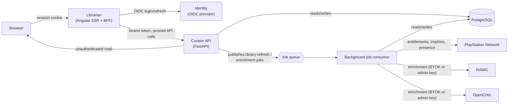
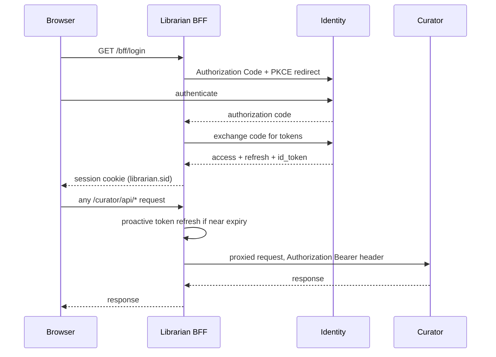
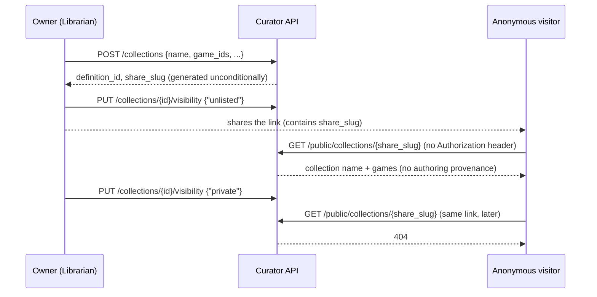
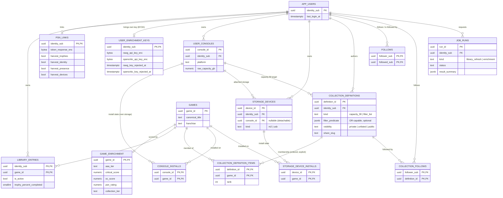
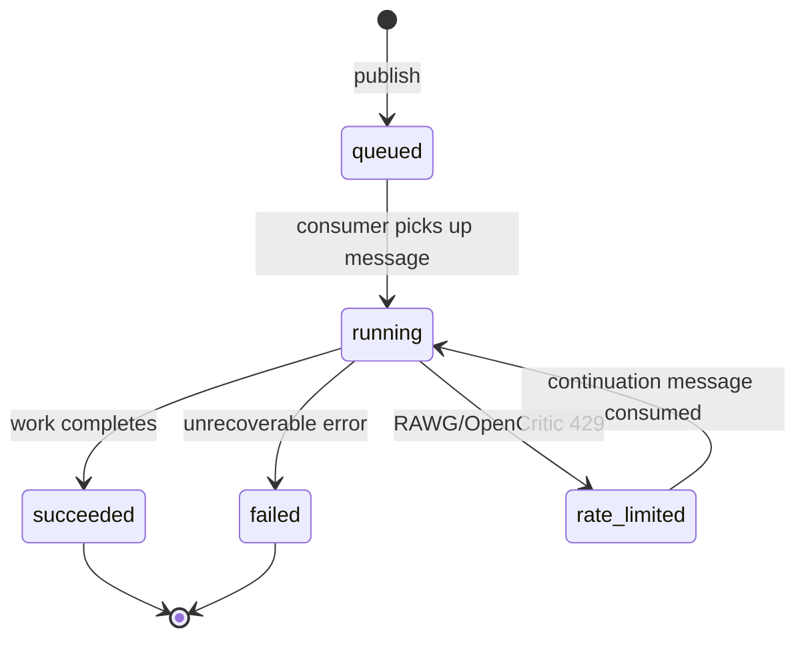

# Architecture

Curator is a PlayStation game-curation API. A user links their PlayStation Network (PSN) account, imports
their entitlements (owned games), and builds named **collections** from them — explicit, ordered lists a
user curates and can optionally share via a public link. [Librarian](https://github.com/crgolden/Librarian)
is the web frontend; it never calls PSN, RAWG, or OpenCritic itself — Curator is the only thing that does.

## System overview



The last edge is `GET /public/collections/{share_slug}` — the one route with no `Authorization` header at
all, serving a collection's public share link to anyone with the link, signed in or not.

## Sign-in

Librarian's BFF (Backend-for-Frontend) holds the OIDC session; the browser never sees a token.



A 401 from Curator triggers exactly one silent token refresh and retry before the BFF gives up and sends
the browser back through login.

## Library refresh, with rate-limit continuation

`POST /library/refresh` returns immediately with a `run_id`; the actual work happens off the request path
so a large library (PSN allows no batch entitlement endpoint) never ties up an HTTP connection.

```mermaid
sequenceDiagram
    participant Librarian
    participant Curator as Curator API
    participant Queue as Job queue
    participant Worker as Job consumer
    participant DB as PostgreSQL
    participant PSN
    participant RAWG as RAWG / OpenCritic

    Librarian->>Curator: POST /library/refresh
    Curator->>DB: INSERT job_runs (status=queued)
    Curator->>Queue: publish library-refresh message
    Curator-->>Librarian: 202 {run_id}

    Queue->>Worker: deliver message
    Worker->>DB: try_begin_delivery(run_id, seq) (skips stale redeliveries -- see below)
    Worker->>PSN: fetch entitlements
    Worker->>DB: canonicalize + upsert library_entries/games (commits before enrichment)
    loop each game
        Worker->>RAWG: enrich (BYOK or admin-rotated key)
        alt key rejected (401/403)
            Worker->>Worker: disable that provider for the rest of this run, retry the same game
            Worker->>DB: mark_*_key_rejected, audit log entry
        else rate limited (429)
            Worker->>DB: mark_rate_limited(run_id, result_summary)
            Worker->>Queue: schedule continuation message (backoff)
            Note over Worker,Queue: run pauses here; resumes from the same point later
        end
    end
    Worker->>PSN: match + fetch trophy completion
    Worker->>DB: mark_succeeded(run_id, result_summary)

    Librarian->>Curator: GET /library/refresh/{run_id} (polled)
    Curator-->>Librarian: status + result_summary
```

Entitlement ingestion commits before enrichment runs, so a rejected key, a rate limit, or a transient
network error during enrichment costs a user enrichment signal and trophy-match data for that pass — never
the underlying library import itself.

`job_runs.seq` is a checkpoint counter, bumped every time `mark_rate_limited` records a pause and stamped
into that pause's continuation message. `try_begin_delivery` is a compare-and-swap on `(run_id, seq)`: a
message redelivered after its own settlement failed (e.g. a Service Bus lock lapsing mid-run) carries a
`seq` that a later checkpoint has already superseded, so the guard settles it without reprocessing instead
of restarting the whole batch.

## Collection sharing



An unknown `share_slug` and a `"private"` collection's `share_slug` are deliberately indistinguishable —
both 404. A collection that was shared and later made private stops working exactly like one that never
existed; there is no separate "revoked" state to fall out of sync with `visibility`.

## Data model

Scoped to the entities a user or a collaborating repo actually interacts with. Not shown: pure lookup and
provider/contributor-cache tables (`genres`, `publisher_tiers`, `franchise_rules`, `edition_ranks`,
`size_estimates`, `rawg_cache`, `opencritic_cache`, `psn_catalog_cache`, `psn_game_search_cache`,
`psn_player_search_cache`, `exclusion_rules`, `global_exclusions`, `data_quality_flags`,
`game_name_overrides`, `curation_rule_pass_state`, `game_measured_sizes` — WP13's global, upserted,
any-authenticated-user-may-contribute install-size cache, `game_enrichment`'s own shape rather than the
per-user history table it replaced) and audit/history tables (`account_action_log`, `entitlement_pulls`,
`entitlement_snapshots`, `collection_runs`, `collection_items`).



A collection's membership (`collection_definition_items`) is explicit and stored — never a live query. Two
tables carry `genre_filter`/`min_score`/`aaa_tier_filter`/`filter_predicate` as **provenance only**: they
record how a collection was first assembled (and let its owner ask for a fresh proposal), but nothing ever
re-evaluates them to decide what's actually in the collection.

## Job lifecycle

`job_runs.status` drives both `library_refresh` and `enrichment` jobs identically.



`rate_limited` is not an error — it is an expected, self-resolving pause. The same `run_id` is republished
to a continuation queue once the provider's limit is expected to have lifted, and `result_summary` merges
across every resume so the run's final report describes the whole job, not just its last leg. A run can
cycle through `rate_limited` → `running` more than once before reaching a terminal state.

## Enrichment: BYOK first, then a rotating admin key

Every user may configure their own RAWG/OpenCritic API key (`user_enrichment_keys`, encrypted at rest).
When a request needs enrichment and no per-user key is configured, Curator falls back to a rotating pool of
admin-held keys (`RotatingRawgClient`/`RotatingOpenCriticClient`) so enrichment still functions for users
who haven't brought their own key. A key that a provider rejects (401/403) disables *only that provider*
for the rest of the run — the run still reaches `succeeded`, `result_summary.rejected_providers` records
what was skipped, and the rejection is persisted (`rawg_key_rejected_at`/`opencritic_key_rejected_at`) so
`/psn` can prompt the owner to re-enter a dead key without them discovering it via a string of quietly
degraded refreshes.

## Where this lives

Agent-facing operational detail not shown here — hosting, Key Vault secret names, credential-store
mappings, ADO project links, work-package history — lives outside this repo in the workspace-root
`AGENTS/Curator.md` (not version-controlled; see `AGENTS.md`'s explanation of the workspace layout).
